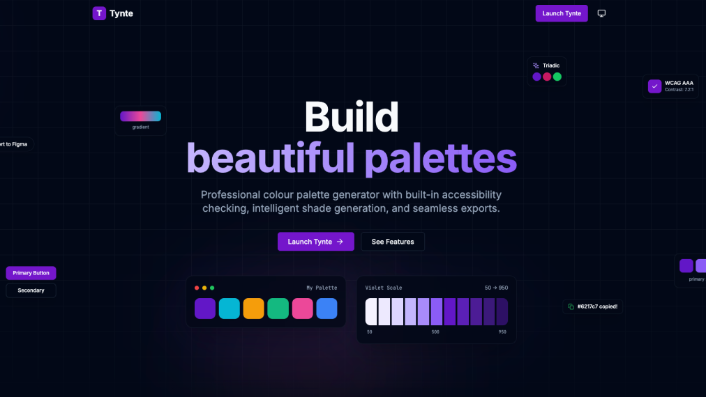

# Tynte

A professional colour palette generator built with React, TypeScript, and Tailwind CSS. Create accessible colour palettes with built-in WCAG contrast checking, colourblind simulation, intelligent shade generation, and seamless exports.



## Live Demo

Visit [tynte.vercel.app](https://tynte.vercel.app) to try it out.

## Features

### Palette Management
- Create and manage multiple colour palettes
- Organise colours into customisable swatch groups (Primary, Secondary, Accent, etc.)
- Drag and drop to reorder colours
- Lock colours to prevent accidental changes
- Revert colours to previous values
- Duplicate and delete palettes

### Colour Generators
- **Harmony Generator** - Create colour harmonies (complementary, triadic, analogous, tetradic, split-complementary)
- **Scale Generator** - Generate perceptually uniform 50-950 shade scales using OKLCH colour space
- **Gradient Generator** - Build linear, radial, and conic gradients with multiple colour stops
- **Image Extractor** - Extract dominant colours from uploaded images

### Accessibility Tools
- **Contrast Checker** - Check WCAG contrast ratios with AA/AAA compliance indicators
- **Contrast Matrix** - Analyse contrast across your entire palette with text/background role assignment
- **Colourblind Simulator** - Preview how your palette appears under 7 types of colour vision deficiency
- **Accessibility Report** - Generate comprehensive reports with fix suggestions
- **Mark as Reviewed** - Acknowledge intentional accessibility choices without removing warnings

### Component Preview
- Preview your palette on real UI components (buttons, cards, forms, alerts)
- Toggle between light and dark mode
- Adjust base shade selection

### Export Options
- CSS custom properties
- SCSS variables
- Tailwind CSS config
- JSON
- Figma design tokens

## Tech Stack

- **React 18** with TypeScript
- **Vite** for fast builds with code splitting
- **Tailwind CSS** for styling
- **Zustand** for state management with localStorage persistence
- **Framer Motion** for animations
- **React Router** for client-side routing
- **Web Workers** for background processing
- **Lucide React** for icons

## Performance

- **Code splitting** - Heavy components lazy-loaded on demand
- **LRU caching** - CVD simulations cached to avoid recalculation
- **Web Workers** - Image colour extraction runs off the main thread
- **Optimised bundles** - Vendor chunks for better caching

## Getting Started

### Prerequisites
- Node.js 18+
- npm or yarn

### Installation

```bash
# Clone the repository
git clone https://github.com/shoobzy/tynte.git
cd tynte

# Install dependencies
npm install

# Start the development server
npm run dev
```

The app will be available at `http://localhost:5173`:
- `/` - Marketing homepage with interactive feature demos
- `/app` - Full palette generator application

### Build for Production

```bash
npm run build
npm run preview  # Preview the production build
```

## Project Structure

```
src/
├── components/
│   ├── ui/           # Reusable UI components
│   ├── layout/       # Header, Sidebar
│   ├── palette/      # Palette management components
│   ├── generators/   # Colour generators
│   ├── accessibility/# Accessibility tools
│   ├── export/       # Export components
│   ├── preview/      # Component preview
│   └── marketing/    # Landing page components
├── pages/            # Page components
├── stores/           # Zustand stores
├── utils/            # Utility functions
├── workers/          # Web Workers
├── types/            # TypeScript types
└── data/             # Presets and defaults
```

## Colour Science

Tynte uses modern colour science principles:

- **OKLCH colour space** for perceptually uniform shade generation
- **WCAG 2.1 contrast algorithms** for accessibility checking
- **Machado et al. (2009)** matrices for colour vision deficiency simulation

## Browser Support

- Chrome (recommended)
- Firefox
- Safari
- Edge

Note: The EyeDropper API (colour picker from screen) is only available in Chromium-based browsers.

## License

MIT

## Author

Built by [Steve Hobbs](https://github.com/shoobzy)
